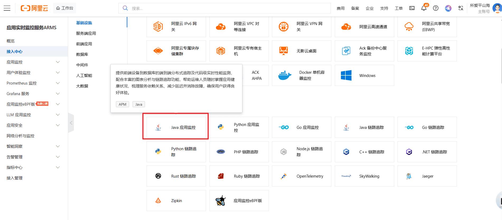
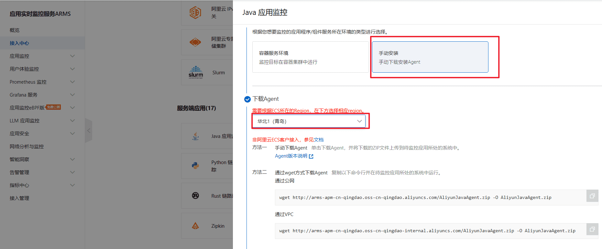
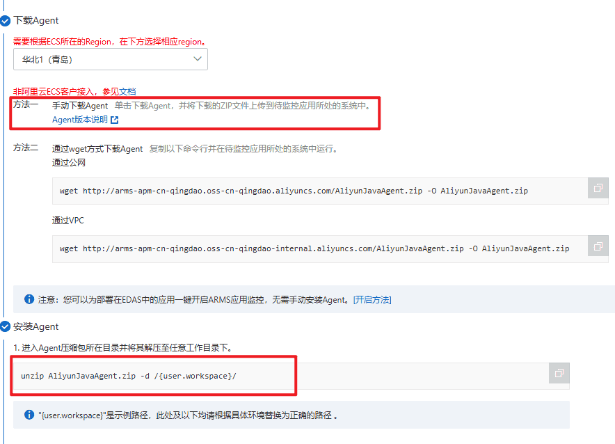
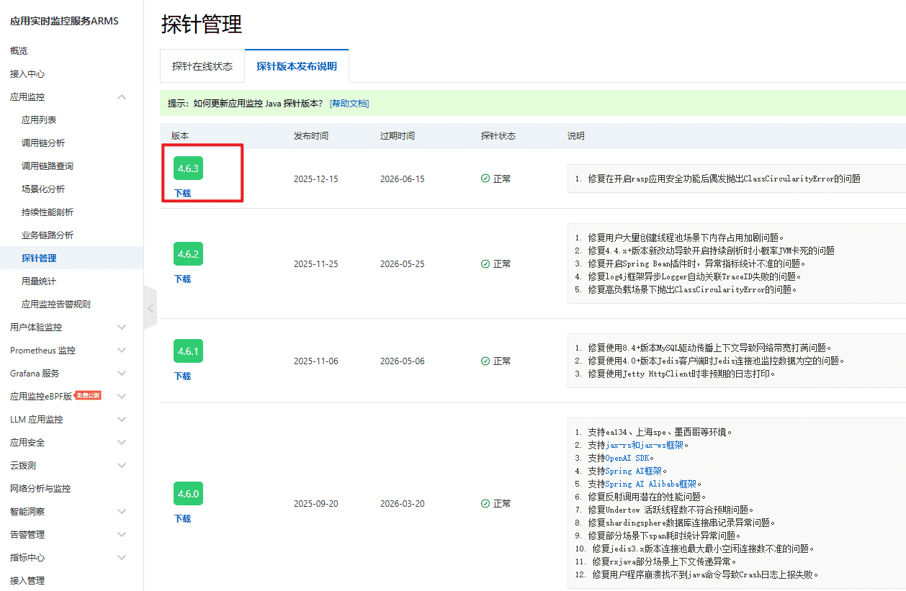
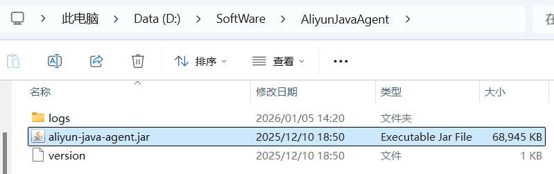
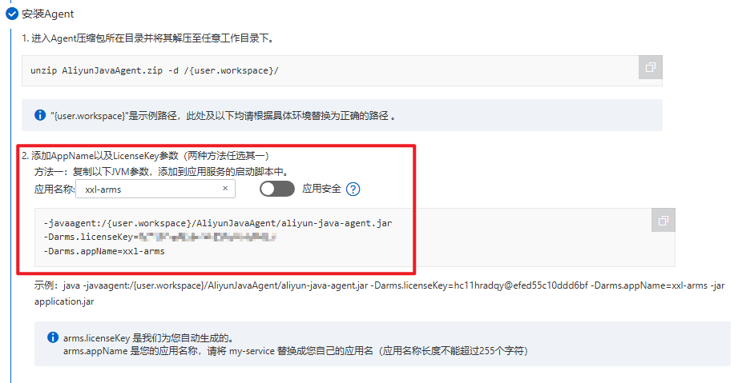

## ARMS 系统监控

### 什么是 ARMS？

[ARMS](https://armsnext.console.aliyun.com/) 是阿里云提供的应用实时监控服务，采用了探针技术，**能够在不修改应用代码的情况下**，自动收集和分析应用性能数据，快速构建实时的监控能力。

还记得我们‍刚刚讲的 “怎么实‌现可观测性” 的 ‍4 个核心问题么？‍ARMS 给出了这‍样的答案：

1）统计什么？

ARMS 能够监‍控 Java 应用性能（CPU‌、内存、线程、GC 等）、应用‍调用链追踪、异常分析诊断、请求‍数、错误数、平均耗时、连接池/‍线程池监控等全方位指标。

2）如何收集？

通过 Ja‍va Agent ‌技术，在 JVM ‍启动时加载监控代理‍，实现无侵入式的‍数据收集。

3）如何存储？

数据存储在阿里云的分布式存储系统中，用户无需关心存储细节。

4）如何展示？

ARMS ‍提供了丰富的 We‌b 控制台，支持多‍维度的数据分析和可视‍化展示。

### 接入 ARMS

在使用任何云产品之前，我们都需要先了解其 [计费规则](https://help.aliyun.com/zh/arms/application-monitoring/product-overview/billing-description)，保护好自己的 money。

好在 ARMS 提供的免费资源，一般足够个人测试使用：

下面我们来接入 ARMS，首先访问 [ARMS 控制台](https://arms.console.aliyun.com/?accounttraceid=f665b274f2dd4a82b30ae1ac90df7514lmmw#/intgr/integrations?menu=server-app)，第一次使用需要开通服务。

进入接入中心，选择 Java 应用监控：

选择手动安装 Agent：

按照指引下载 Agent 包：

从这里下载：

下载完成后解压到合适的位置，比如我这里的解压路径是 `D:/SoftWare/AliyunJavaAgent/aliyun-java-agent.jar`。

复制启动命‍令，注意替换目录路‌径和应用名称。应用‍名称可以自定义，建‍议使用有意义的名称便于‍后续管理。

你也可以选择开启应用安全功能，它能够提供 [应用层面的安全监控能力](https://help.aliyun.com/zh/arms/application-security/product-overview/what-is-application-security?spm=5176.arms.console-base_help.dexternal.7c48f167HlhHqR)，帮你抵御一些漏洞攻击。

在 IDE 中编辑项目的启动配置，将复制的命令参数添加到 `VM options` 中：

~~~sh
-javaagent:D:/SoftWare/AliyunJavaAgent/aliyun-java-agent.jar
-Darms.licenseKey=xxx
-Darms.appName=xxl-arms
~~~

⚠️ 注意，需要将参数间的换行替换为空格！

接下来启动项目‍。启动会比平时‌慢一些，这是正常的‍，因为引入 Age‍nt 会拖慢启动速‍度。

看到下图信息就表示启动成功了，默认数据会上报到杭州区域：

最后，回到‍ ARMS 控制台‌的应用列表页面，就‍能看到刚刚接入的应‍用了：

[免费在线图片压缩工具 - docsmall](https://docsmall.com/image-compress)